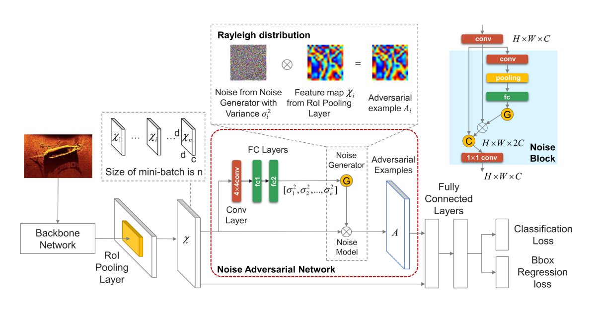

<a name="readme-top"></a>


<!-- PROJECT LOGO -->
<br />
<div align="center">
  <a href="https://github.com/Newbyl/FR-CNN-with-NAN">
    
  </a>

<h3 align="center">Faster RCNN with Noise Adversarial Network</h3>

  <p align="center">
    This repository contains the implementation of <strong>Training with Noise Adversarial Network: A Generalization Method for Object
    Detection on Sonar Image</strong>
    <br />
    <a href="https://openaccess.thecvf.com/content_WACV_2020/papers/Ma_Training_with_Noise_Adversarial_Network_A_Generalization_Method_for_Object_WACV_2020_paper.pdf"><strong>Link of the paper »</strong></a>
    <br />
    <br />
    <a href="https://colab.research.google.com/drive/1kEU1wpLT1JNoSt1oW2ZMoATsHLki2aCY?usp=sharing">View Demo</a>
  </p>
</div>


<!-- ABOUT THE PROJECT -->
## About The Project

This project was for a course named "Advanced research project" where we had to choose a paper, make a report about it and implement the main features of it. I choose to start with this <a href="https://github.com/trzy/FasterRCNN">incredible implementation of Faster RCNN</a> in pytorch.

<p align="right">(<a href="#readme-top">back to top</a>)</p>


### Built With

* 
* 

<p align="right">(<a href="#readme-top">back to top</a>)</p>


<!-- GETTING STARTED -->
## Getting Started

To train this model use the following command :

```console
$ python -m pytorch.FasterRCNN --train --learning-rate=1e-3 --weight-decay 1e-4  --epochs=5 --load-from=vgg16_caffe.pth --save-best-to=results_1.pth --checkpoint-dir it_checkpoint
```

To get all the option you can use this command :

```console
$ python -m pytorch.FasterRCNN --help
```

To infer an image through the network use  :

```console
$ python -m pytorch.FasterRCNN --load-from=fasterrcnn_pytorch_vgg166.pth --predict-to-file=images_demo/noisy_image.jpg
```

It will save the result of the inference in a file called "prediction.png" in your current directory.


<!-- What's new ? -->
## What's new ?

Following the paper, I implemented the Noise Adversarial Network present I the paper, you can find it in <a href="https://github.com/Newbyl/FR-CNN-with-NAN/blob/main/pytorch/FasterRCNN/models/detector.py"> here </a> named NoisePredictor : 

```Py
class NoisePredictor(nn.Module):
    def __init__(self, roi_size=512, hidden_dim=512):
        super().__init__()
        self.conv1 = nn.Conv2d(roi_size, hidden_dim, kernel_size=4, padding=0)
        self.fc1 = nn.Linear(hidden_dim, hidden_dim)
        self.fc2 = nn.Linear(hidden_dim, 1)
        
    def forward(self, x):
        x = F.relu(self.conv1(x))
        x = x.view(-1, 512)  # Flatten the tensor
        x = F.relu(self.fc1(x))
        x = self.fc2(x)
        
        return x.mean().abs()
```

You can find its integration in the DetectorNetwork class in the same file : 

```Py
    #############################
    #                           #
    # Noise adversarial network #
    #                           #
    #############################
    
    if self.training:
    
      # numbers of RoI
      nb_roi = rois.size(dim=0)
      
      # Initialize roi_out_noise
      rois_noise = t.zeros_like(rois).cuda()
      
      for n_roi in range(nb_roi):
        # generate noise
        noise_scale = self._noise_predictor(rois[n_roi]).cpu().detach().numpy()

        noise = np.random.rayleigh(scale=noise_scale, size=rois[n_roi].cpu().shape)
        noise = t.from_numpy(noise).cuda()
        
        # Update roi_out_noise
        rois_noise[n_roi] = rois[n_roi] + noise
        
      # Uncomment to see the RoI with and without noise
      """
      if (len(rois) != 0 or len(rois_noise) != 0):
        save_image(self.conv2(rois_noise[0]).cpu(), 'roi_noise.png')
            
        save_image(self.conv2(rois[0]).cpu(), 'roi_out.png')"""
    
    ####################################
    #                                  #
    # End of noise adversarial network #
    #                                  #
    ####################################
    

      # Forward propagate for noise loss
      y_noise = self._pool_to_feature_vector(rois = rois_noise)
      classes_raw_noise = self._classifier(y_noise)
      classes_noise = F.softmax(classes_raw_noise, dim = 1)
      box_deltas_noise = self._regressor(y_noise)
```

I also added the Kullback-Leiber loss present in the paper : 

```Py
def kl_div_loss(original_output, adversarial_output):
    """
    Computes the kl divergence loss between the original distribution
    and the noisy one.

    Parameters
    ----------
    original_output : torch.Tensor
        The output of the model for the original examples, (N, num_classes).
    adversarial_output : torch.Tensor
        The output of the model for the adversarial examples, (N, num_classes).

    Returns
    -------
    torch.Tensor
        Scalar loss.
    """
    original_output = F.log_softmax(original_output, dim = -1)
    adversarial_output = F.softmax(adversarial_output, dim = -1)

    Ladv = F.kl_div(original_output, adversarial_output, reduction='batchmean')
    return Ladv
```

I also did small changes to get all the useful statistics and add the new losses to the model.


## What I need to improve

I need to optimize the noise generation part, in fact I use Numpy to do so when I could only use PyTorch to do all the computation on the GPU and avoid huge bottleneck.


<!-- CONTACT -->
## Contact

nabyl.quignon@etu.univ-orleans.fr

Project Link: [https://github.com/Newbyl/FR-CNN-with-NAN](https://github.com/Newbyl/FR-CNN-with-NAN)

<p align="right">(<a href="#readme-top">back to top</a>)</p>


